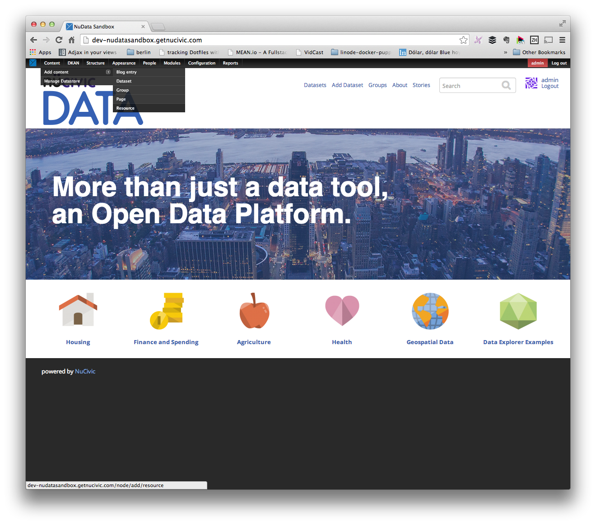
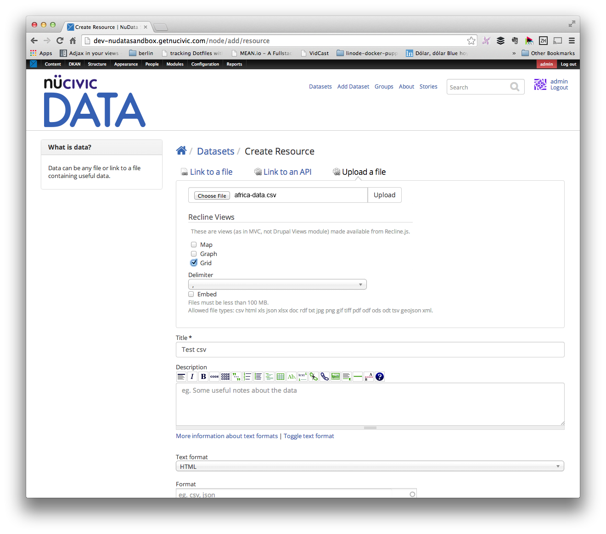
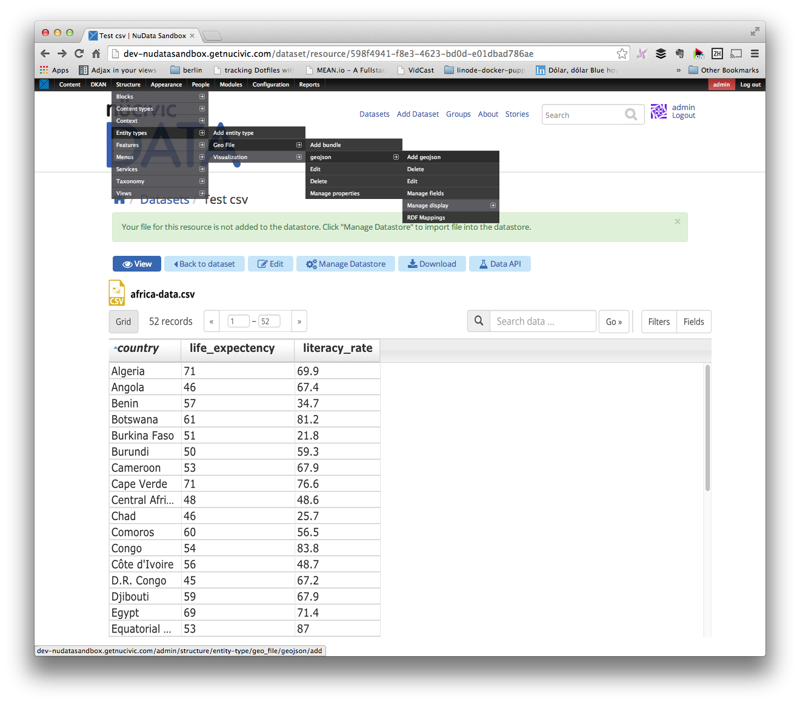
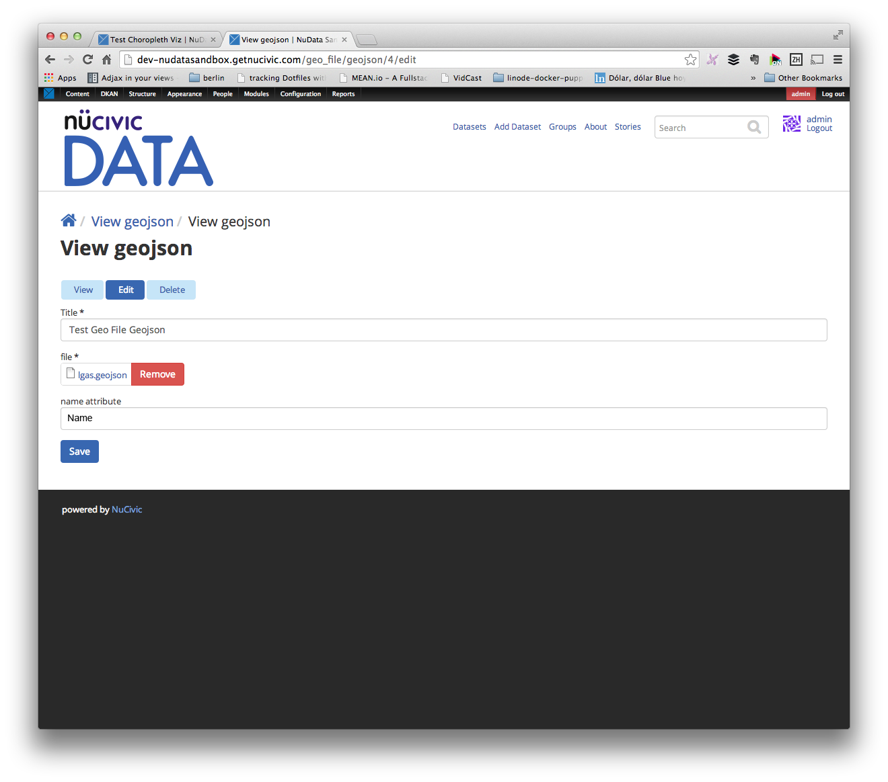
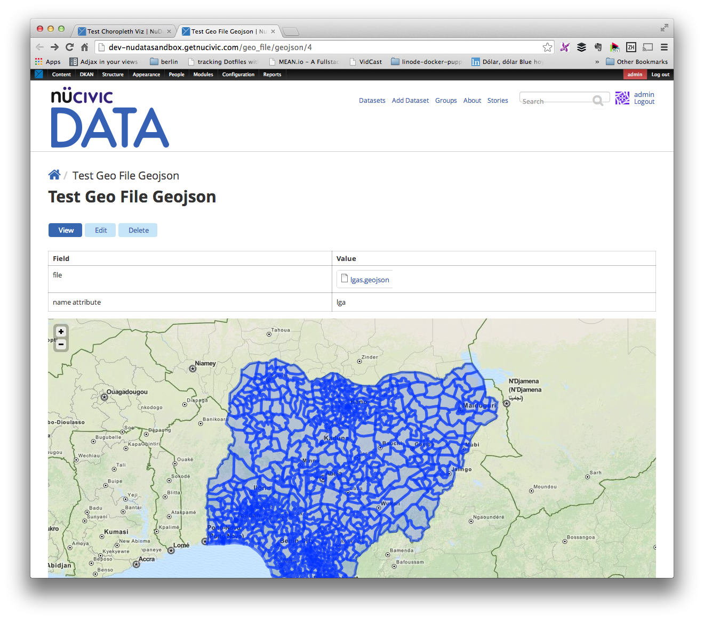
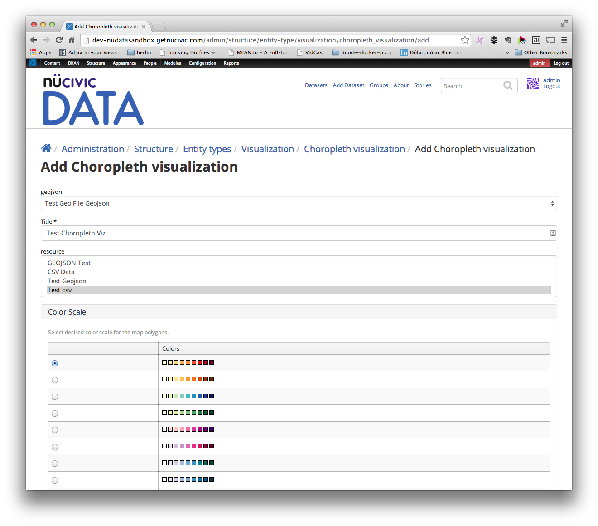
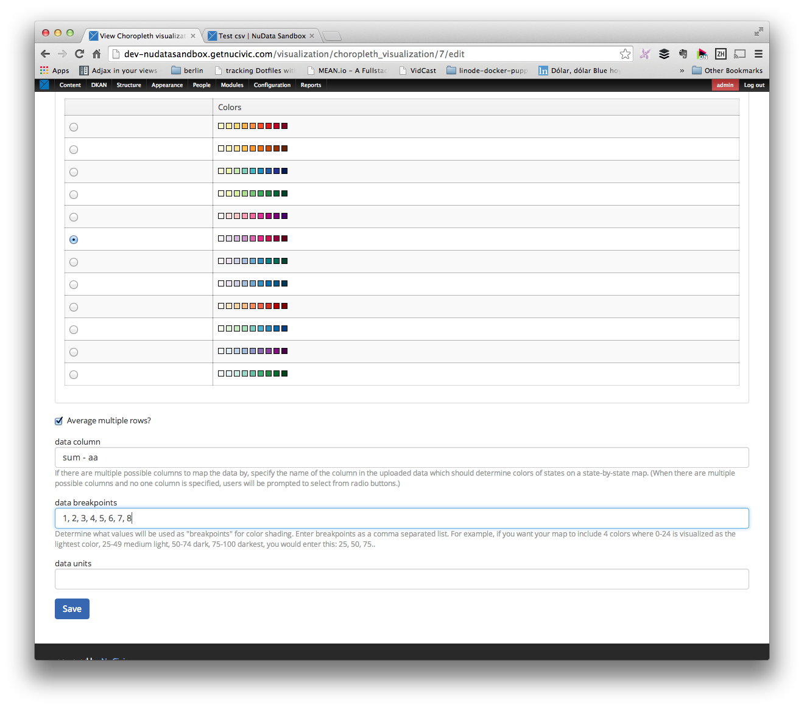
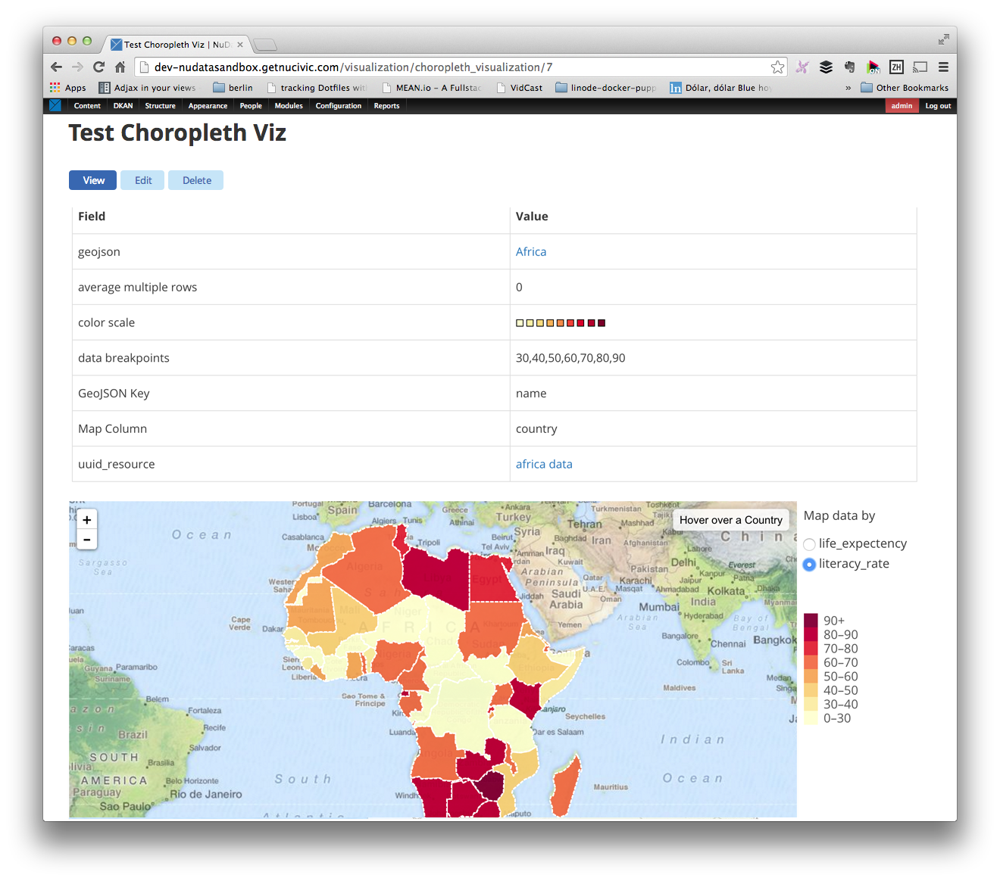

## Setup

Follow the [[installation instructions|Installation]] then make sure the choropleth bundle is enabled:

```bash
$ drush en -y visualization_entity_choropleth_bundle
$ drush cc all
```

## Examples Files

Two example files are provided in the **examples** folder:
```bash
africa.geojson
africa-data.csv
```

## Create Visualization

+ Look for **Content -> Add Content -> Resource** in the admin menu and click on it.



+ Upload a **africa-data.csv** file from the examples folder for the resource.



+ Fill the required fields and **save** the resource


+ Look for **Structure -> Entity Types -> Geo File -> geojson -> Add geojson** in the admin menu and click on it.



+ Set **Title**
+ Upload a **geojson** file
+ Fill **name attribute** with the **column name** in the data (csv resource) that will match the **name** property for the features in the **geojson** file.



+ Click **Save**.
+ You'll get a preview for the geojson file you just uploaded.



+ Look for **Structure -> Entity Types -> Visualization -> Choropleth Visualization -> Add Choropleth Visualization** in the admin menu and click on it.


+ Fill Title
+ Select the **geojson** file we created for the **geojson** field.
+ Select the **resource** file we created for the **resource** field.



+ Select the **colors** you like to use for the choropleth map.
+ Fill **data column** with the column in the csv data you'll like to pick as the source of numerical data for the polygon coloring. If you leave this field blank, you'll get a list of radio buttons to pick up the column when the visualization gets rendered.
+ Fill the **data breakpoints** with comma separated numbers. If you leave this field blank, breakpoints will be calculated for you based on the data.



+ Click **Save** & Enjoy!

