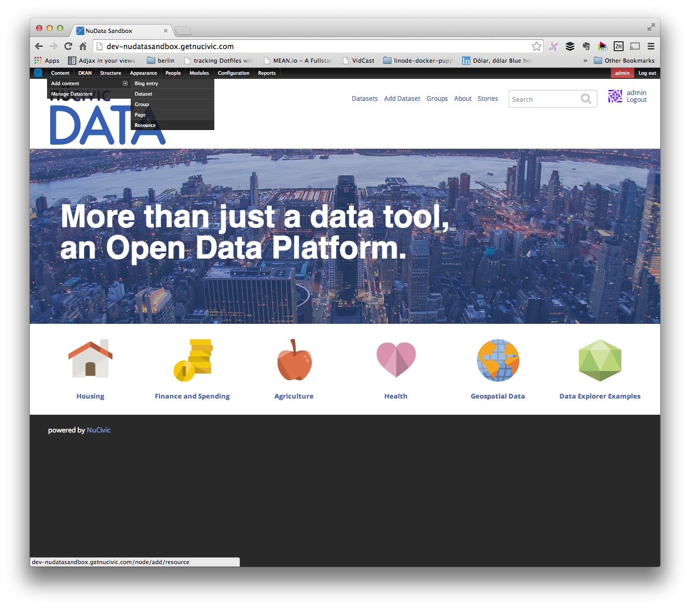

## Setup

Make sure the geojson bundle is enabled:

```bash
$ drush -y visualization_entity_geojson_bundle
$ drush cc all
```

## Create Visualization

+ Look for **Content -> Add Content -> Resource** in the admin menu and click on it.



+ Upload a **geojson** file for the resource


+ Fill the required fields and **save** the resource


+ Look for **Structure -> Entity Types -> Visualization -> Geojson Visualization -> Add Geojson Visualization** in the admin menu and click on it.


+ Set a **title**
+ Select the **resource** containing the **geojson** file you uploaded


+ Click **Save** & Enjoy!


