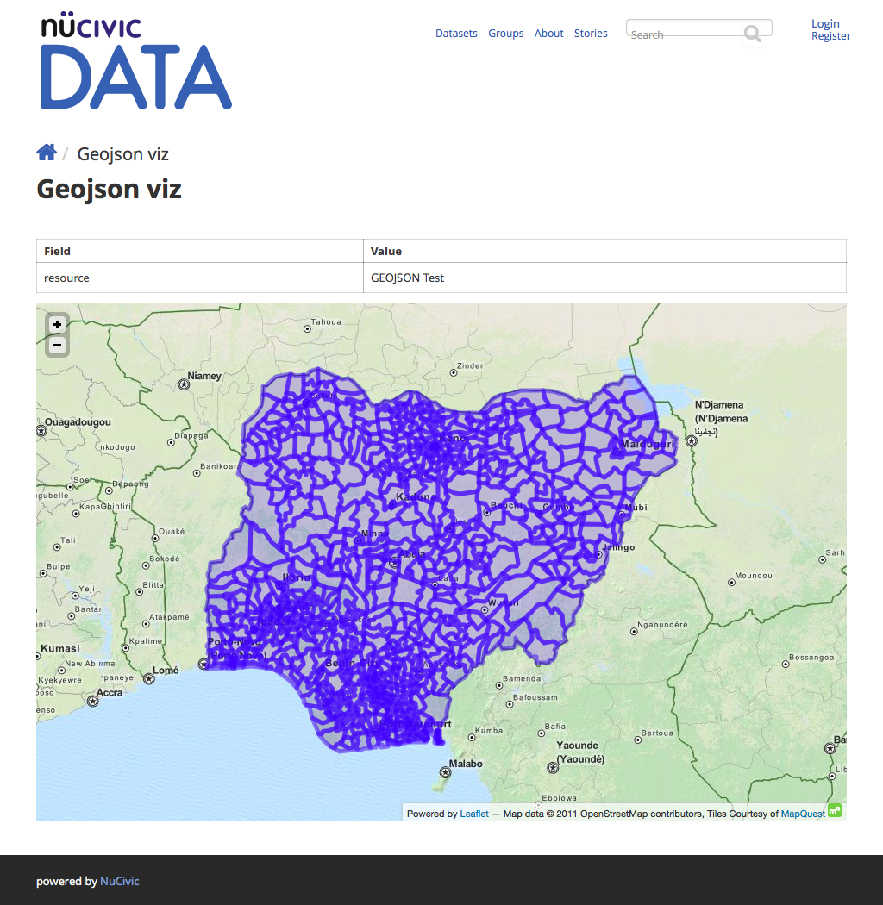

# Concept behind the module

This module **aims** to provide:

+ A base drupal entity to extend and create **visualization bundles**.
+ A set of visualization bundles that provide functionality out of the box for the module and indicate a good example for extending this entity.
+ A set of permissions common to all visualization bundles.
+ A common "iframe view" shared between all visualization bundles.
+ A common "embed" functionality shared between all visualization bundles.

The two bundles provided with this module are the **geojson** and **choropleth** module.

## Geojson Bundle

## Choropleth Bundle

## Further Work and Collaboration

This module is **still on early development**. For the moment we are not taking issues.
