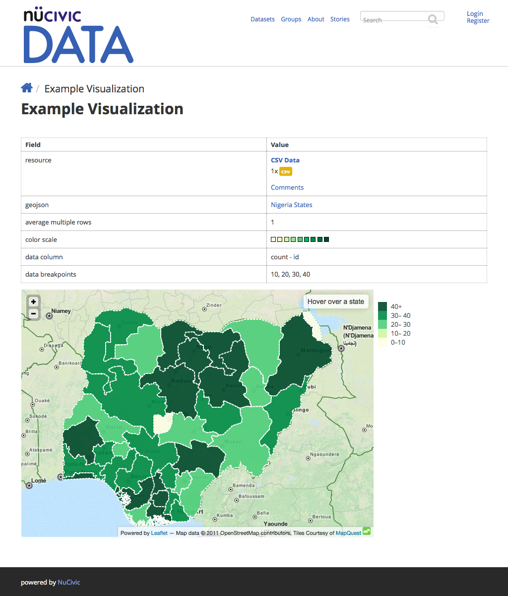

## Installation Instructions

### Install Visualization Entity

#### Install from github zip

```bash
# cd into your site's docroot and:
mkdir -p sites/all/modules/nucivic/
cd sites/all/modules/nucivic
wget https://github.com/NuCivic/visualization_entity/archive/master.zip
unzip master.zip
mv visualization_entity-master visualization_entity
cd ../../../../
drush make --no-core sites/all/modules/nucivic/visualization_entity/visualization_entity.make
drush -y en visualization_entity
drush cc all
```

#### Install from git working copy

```bash
# cd into your site's docroot and:
mkdir -p sites/all/modules/nucivic/
cd sites/all/modules/nucivic/
git clone git@github.com:NuCivic/visualization_entity.git
cd ../../../../
drush make --no-core sites/all/modules/nucivic/visualization_entity/visualization_entity.make
drush -y en visualization_entity
drush cc all
```

### Install Bundles

#### Geo JSON Bundle

```bash
drush -y en visualization_entity_geojson_bundle
drush cc all
```

#### Choropleth Bundle



```bash
drush -y en visualization_entity_choropleth_bundle
drush cc all
```
